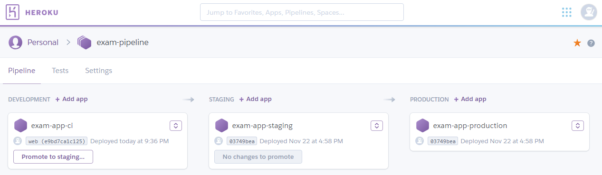
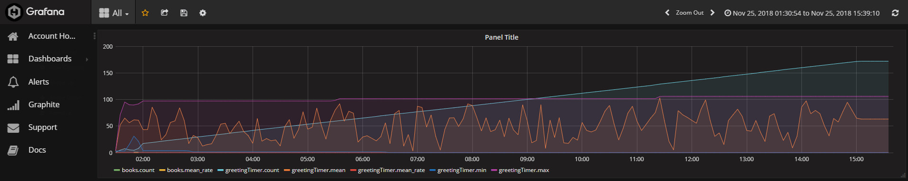
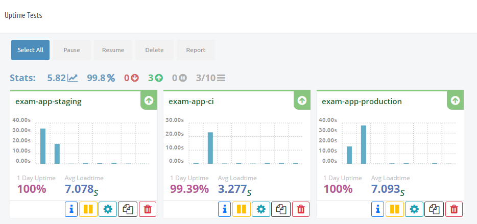
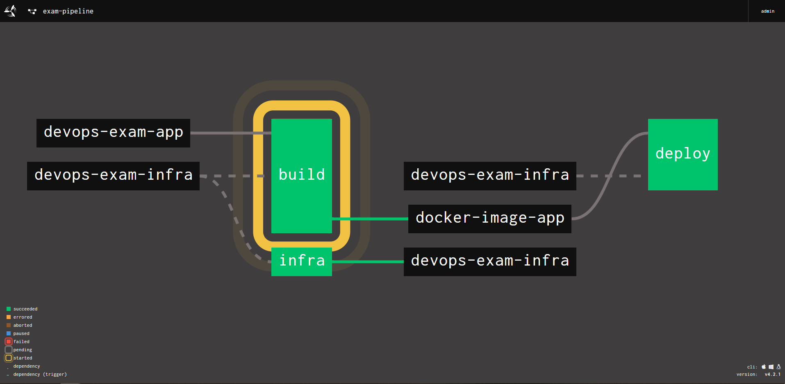

# DevOps Exam

## Oppgave

Fullførte oppgaver:

- Basis pipeline
- Docker
- Overvåkning, varsling og Metrics

## Applikasjon

Applikasjonen er en Spring Boot applikasjon skrevet i Kotlin og bygges med maven.
Løsningen består av to APIer:

- Greeting. Velkomstside.
- Books. API for bøker, støtter CRUD-operasjoner.

Når det gjelder valg av logging har jeg valgt Logback, fordi den brukes default av Spring Boot Starter. Siden default log-level i Spring Boot er `info` så har jeg satt ned log-level til debug for APIene, på grunn av at det meste logges til `debug`. Dette pga. lettere sensur.

## Infrastruktur

Applikasjonen hostes i Heroku i tre forskjellige miljøer: CI, Staging og Prod.

### Hosted Graphite + Grafana

For hvert miljø så er en Hosted Graphite addon provisjonert. Hosted Graphite henter metrics fra samtlige endepunkter fra applikasjonen, hvor meter, timer og counter er blitt benyttet. Data samlet inn blir visualisert med Grafana.

### StatusCake

For hvert miljø så er det satt opp en test i StatusCake som sjekker oppetid på applikasjonen.

## Pipeline

## Setup

### Forutsetninger

- Concource: https://raw.githubusercontent.com/starkandwayne/concourse-tutorial/master/docker-compose.yml
- StatusCake
- Heroku med kredittkort
- GitHub
- To nøkkelpar

### Steg

#### Config

- StatusCake: https://app.statuscake.com/User.php. Key.
- Github token: https://github.com/settings/tokens/new. Scope: repo + admin:repo_hook
- 2 deploy keypairs. Generate, then add to repo. infra + app. Allow write. https://developer.github.com/v3/guides/managing-deploy-keys/#deploy-keys
- Heroku: https://dashboard.heroku.com/account. API Key. Credit card: https://dashboard.heroku.com/account/billing

credentials.yml
variables.tf

#### Pipeline

1. `docker-compose up -d`
2. `fly -t devops-exam login --concourse-url http://127.0.0.1:8080 -u admin -p admin`
3. `fly -t devops-exam set-pipeline -p exam-pipeline -c concourse/pipeline.yml -l credentials.yml`
4. `fly -t devops-exam unpause-pipeline -p exam-pipeline`

Når ferdig: `docker-compose down`

## Merknader
