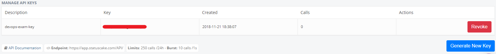

# DevOps Exam

## Oppgave

Fullførte oppgaver:

- Basis pipeline
- Docker
- Overvåkning, varsling og Metrics

## Applikasjon

Applikasjonen er en Spring Boot applikasjon skrevet i Kotlin og bygges med maven.
Løsningen består av to APIer:

- Greeting. Velkomstside.
- Books. API for bøker, støtter CRUD-operasjoner.

Når det gjelder valg av logging har jeg valgt Logback, fordi den brukes default av Spring Boot Starter. Siden default log-level i Spring Boot er `info` så har jeg satt ned log-level til `debug` for APIene, på grunn av at det meste logges til `debug`. Dette pga. lettere sensur.

## Infrastruktur

Applikasjonen hostes i Heroku i tre forskjellige miljøer: CI, Staging og Prod. På grunn av begrensinger i Heroku Container Registry så går det ikke å promotere applikasjonen til flere miljøer. Skulle man gjort dette så måtte man heller utvide pipelinen.  

### Hosted Graphite + Grafana

For hvert miljø så er en Hosted Graphite addon provisjonert. Hosted Graphite henter metrics fra samtlige endepunkter fra applikasjonen, hvor meter, timer og counter er blitt benyttet. Data samlet inn blir visualisert med Grafana.

På grunn av begrensinger i betalingsplanen så benytter koden seg kun av et begrenset antall metrics. Det som har blitt prioritert har vært å logge når endepunktene benyttes og evt. feil eller uønsket oppførsel.

### StatusCake

For hvert miljø så er det satt opp en test i StatusCake som sjekker oppetid på applikasjonen. Hvis varsling via epost er ønsket, så kan man gå inn i den enkelte testen og sette opp en contact group manuelt.

## Pipeline

Pipeline er implementert i Concourse og har følgende steg:

- Infra. Setter opp infrastruktur ved hjelp av Terraform.
- Build. Bygger applikasjonen (`mvn install`) pakker den i et Docker image og laster den opp i Heroku Container Registry.
- Deploy. Henter applikasjonen fra Container Registry og publiserer den til CI-miljøet.

## Instruksjoner for eget oppsett

### Forutsetninger

- Brukerkonto i Heroku ([med kredittkort](https://dashboard.heroku.com/account/billing))
- Brukerkonto i StatusCake
- Brukerkonto i GitHub
- Docker + Docker-Compose

### Steg

#### Konfigurasjoner

1. Fork repo [devops-exam-infra](https://github.com/GardOS/devops-exam-infra) + [devops-exam-app](https://github.com/GardOS/devops-exam-app) TODO: Replace GardOS
2. Opprett to SSH-nøkkelpar. Ett for infra, ett for app.
3. Per repo: legg inn samsvarende public key som deploy key. 
4. Opprett/hent API-token + brukernavn for [Github](https://github.com/settings/tokens/new). Scope skal være: repo + admin:repo_hook. 
5. Opprett/hent API-key + epost for [StatusCake](https://app.statuscake.com/User.php) 
6. Opprett/hent API-key + epost for [Heroku](https://dashboard.heroku.com/account) 
7. Åpne infra repo.
8. Endre navn på credentials_example.yml til credentials.yml.
9. Legg inn verdier i credentials.yml slik at det samsvarer med verdiene hentet i de tidligere stegene.
10. Gjør det samme i terraform/variables.tf (navn er valgfritt).

#### Oppsett

1. Start en [Concourse container](https://raw.githubusercontent.com/starkandwayne/concourse-tutorial/master/docker-compose.yml)
2. Kjør følgende kommandoer:
   - `fly -t devops-exam login --concourse-url http://127.0.0.1:8080 -u admin -p admin`
   - `fly -t devops-exam set-pipeline -p exam-pipeline -c concourse/pipeline.yml -l credentials.yml`
   - `fly -t devops-exam unpause-pipeline -p exam-pipeline`
3. Gå til http://localhost:8080 og logg inn som: U: admin P: admin.
4. Velg _infra_ og kjør bygg (+).
5. Når infra er ferdig så kan _build_-jobben kjøres. Enten manuelt, eller ved å commite til app-repoet.
6. Vent til jobbene har kjørt ferdig.
7. Åpne appen i Heroku.

## Kjente feil:

Error: Sporadisk så feiler Concourse i å hente image fra Docker Hub. Da er det bare å kjøre på nytt. 
